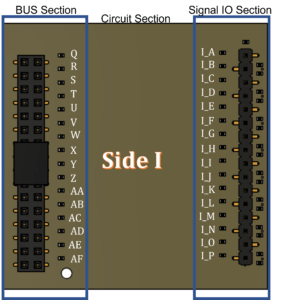
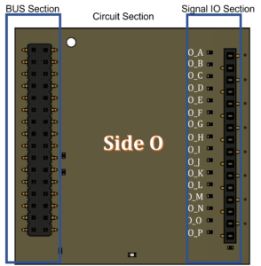

++++++++++++++++
Why E-Lagori
++++++++++++++++
Do you have new amazing product in mind that could solve a problem that you and the world has been facing but dont have suffecient knowledge of electronics to make it happen? Do you have project that is so large that you are stuck up with a bundle of criscrossing wires which may fall apart any time? or Do you want save time and money spent making custom boards which is long lead time process and involves multiple iterations?

Typically these are the questions faced by every developer and project mangement team irrespective of whether it is a small hobby project or large team accomplisihing complex design. Typical process of developing product follows below cycle and time line

Concept Block diagram development - 1 week Circuit development - 8.6 weeks Schematic development - 1 weeks Layout development - 4.3 weeks Procurement and Fabrication - 13 weeks Board bring up - 4.3 weeks Software interface and testing - 21 weeks Total - 53 weeks

We may bo back to previous steps at any point and repeat the process.

Typical way yo reduce the risk of failure is to use the Evaluation boards and DIY boards which at present are not compatiable with each other and hence leads to large volume of wires for interconnectivity.

Following problems are typically faced when designing a new prototype

Systems cannot be built with Eval boards, which forces Custom design too early in the design cycle even before Proof of concept is demonstrated.
Co-design from multiple streams like mechanical eng etc required too early in the design leading to multiple iterations.
High prototype production cost.
Modifications due to change in specifications results in redesign.
Time taken for small batch production is significantly high and most EMS manufacturers are not interested.
Significant wastage of components and resources when iterations are required.
Errors require remaking the complete PCB and Long time lost in iterations.
The primary Question which triggered development of E-LAGORi is "Can we develop an ecosystem where all the above issues are solved and Evaluation boards of multiple companies can be made intecompatible?"

Lets take a step back

At present all systems are composed of Analog section, Digital section and power section. Analog section typically has cascade structure. Digital and power sections has bus structure.

E-Lagori incorporates these basic structures to create a comprahensive stackable architecture where you can select the route of signal path across the modules using a conductive ink. This architecture allows you to decide which signals can enter and exit the module and continue propagation along the system. More about the architecture in the "Architecture of E-LAGORi module" section

++++++++++++++++
What is E-Lagori
++++++++++++++++

E-LAGORi is a modular electronics development platform for hardware system developers in startups, RnD organizations and academic institutions to create innovative large systems without worrying about circuit details. It provides seamlessly connectable modules with advanced functionality. It enables you to develop prototype your dream system without the hassles of circuit development. The platform provides wide range of boards ranging from instrumentation amplifiers to microphone arrays and a convenient way to connect them without any wires.

The aim of the E-Lagori modules is to reduce the pain of building prototypes. E-Lagori ecosystem consists of several modules. Each module has single function and has been designed with great care to perform that function. Each module is 50 mmx50 mm (2in x 2 in) square and 16 mm in height. All the modules have same basic external architecture, but the implemented functionality might be different. These modules can be stacked one over the other and by suitably selecting the signal multiple functionalities may be achieved.

+++++++++++++++++++++++++++++++
Architecture of E-LAGORi module
+++++++++++++++++++++++++++++++

Each module consists of a PCB which has 2 sides named as Side I and Side O, each side has 3 sections. Three sections being the Signal IO section, Circuit implementation section and Bus section as shown in the figure 1. The front view of each module is also shown in the figure 2.

   

   
